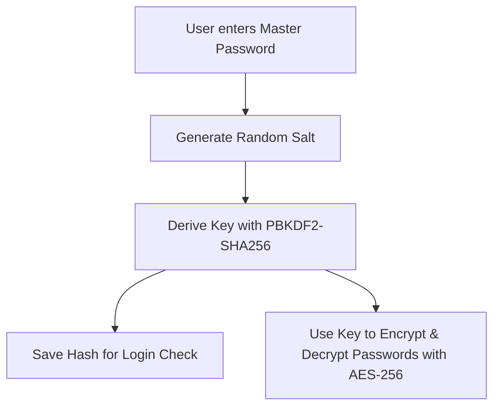

# JPCYPHER — Secure Password Manager

A secure web-based password manager built with Python, Flask, and SQLite. It protects your credentials using strong encryption (AES-256) and secure password hashing (PBKDF2).

---

## Features

- **User Accounts**: Create an account with a single Master Password.
- **Strong Encryption (AES-256)**: All stored passwords are encrypted before being saved to the database.
- **Zero-Knowledge Design**: The server never stores your master password in plain text.
- **Password Generator**: Create strong, random passwords with custom lengths and character types.
- **Password Strength Analyzer**: See real-time feedback on password strength and entropy.
- **Clean Dark Interface**: Simple, responsive dashboard to manage, search, and copy passwords.
- **Audit Logs**: Track account logins and password access for better security.

---

## How It Works



1. **Registration**: When you create an account, your master password is combined with a random salt and hashed 100,000 times using PBKDF2-HMAC-SHA256.
2. **Login**: When you log in, your master password is verified using constant-time comparison to prevent timing attacks.
3. **Vault Storage**: When you add a password, it is encrypted using AES-256 (Fernet) using your derived key and saved to the SQLite database.
4. **Decryption**: Passwords remain masked in the browser. Clicking the reveal or copy icon decrypts the password securely in memory.

---

## Quick Start (1-Click Run)

### Requirements
- Python 3.10 or newer

### On Windows
Double-click `run.bat` or run:
```powershell
python run.py
```

### On Linux / macOS
```bash
chmod +x run.sh
./run.sh
```

The script will automatically install any missing dependencies (`Flask`, `cryptography`), create the database (`password_manager.db`), and start the application on `http://127.0.0.1:5000`.

---

## Running Tests

To verify that all cryptographic functions, database operations, and web routes are working correctly:

```powershell
python -m unittest discover tests
```

---

## Project Structure

- `app.py`: Web server and routes (login, register, vault management, APIs).
- `crypto_utils.py`: Cryptographic functions (PBKDF2 key derivation, AES-256 encryption, password generator).
- `database.py`: SQLite database schema, queries, and audit logging.
- `run.py`: Automated 1-click startup script.
- `templates/`: HTML templates for the user interface.
- `src/`: CSS stylesheets and client-side JavaScript.
- `tests/`: Automated unit and integration test suite.
