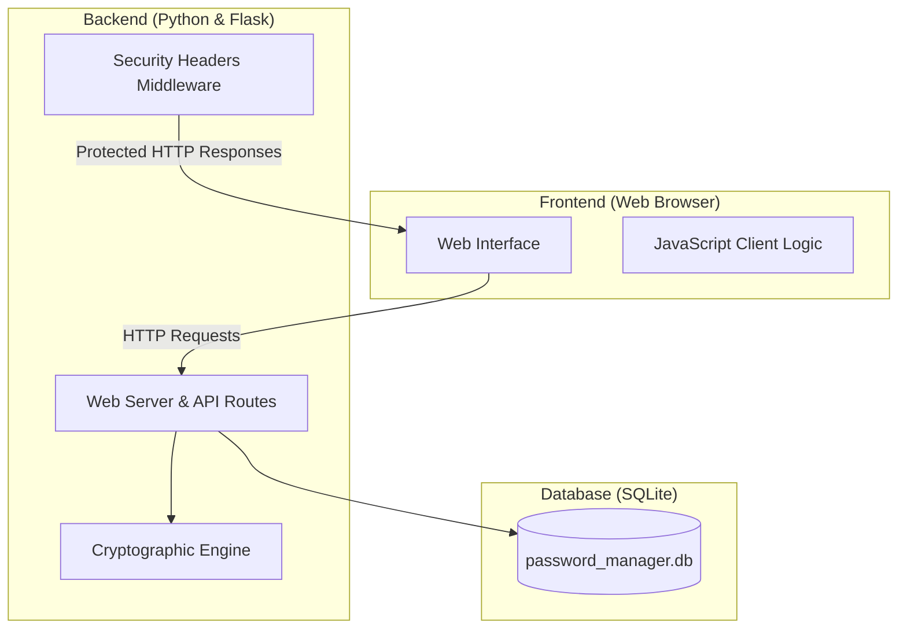
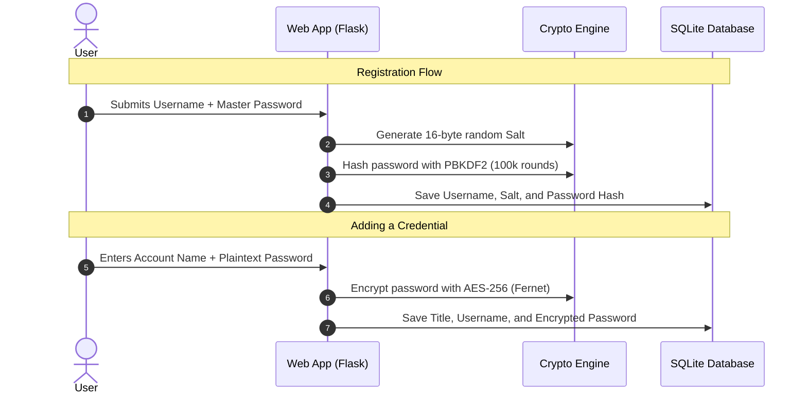

# B207 Cyber Security Project Report
## Design and Implementation of a Secure Password Manager (JPCYPHER)

**Institution:** Gisma University of Applied Sciences — School of Computer Science  
**Module:** B207 Cyber Security  
**Project Topic:** Idea 2: Secure Password Manager with Encryption and Web Interface  
**Author:** Juan Pablo Rojas  
**GitHub Repository:** `https://github.com/jprojas17/CYBERSECPROJECT`  

---

## 1. Introduction

Passwords are the most common way people protect their online accounts. However, many people reuse simple passwords across different websites, which makes them easy targets for hackers. A password manager solves this problem by allowing users to store all their complex passwords in an encrypted vault, protected by a single Master Password.

This project, **JPCYPHER**, is a secure, web-based password manager developed in Python. It provides a simple web interface where users can register, store, generate, search, and retrieve their encrypted credentials safely.

---

## 2. System Architecture

The application is built using a clean three-layer architecture:



1. **Frontend**: Clean HTML, CSS, and JavaScript interface where users manage their vault.
2. **Backend**: A Flask web application that handles user authentication, routes, and security controls.
3. **Cryptographic Engine**: A dedicated Python module that handles key derivation, password encryption, decryption, and password generation.
4. **Database Layer**: An SQLite database that stores user accounts, encrypted credentials, and security audit logs.

---

## 3. How Security and Encryption Work



### 3.1 Password Hashing and Salt
When a user registers:
- The system generates a unique **16-byte random salt** using Python's `secrets` module.
- The master password and the salt are processed through **PBKDF2-HMAC-SHA256** using **100,000 iterations**.
- This produces a strong hash that is saved in the database. Because every user has a different salt, attackers cannot use precomputed rainbow tables to crack passwords.

### 3.2 Symmetric Encryption (AES-256)
- Stored credentials are encrypted using **AES-256 (Fernet)**.
- When a user logs in, their master password and salt are used to derive an encryption key in memory.
- When saving a new password, the application encrypts the text into ciphertext before writing it to SQLite.
- Even if someone steals the database file, they will only see encrypted text and cannot read the stored passwords without the master password.

### 3.3 Protection Against Timing Attacks
When verifying a master password during login, the system uses Python's `hmac.compare_digest()`. This compares the hashes in constant time, preventing attackers from guessing passwords by measuring tiny differences in server response times.

### 3.4 Password Generator and Entropy
The application includes a password generator that lets users create random passwords with customizable length, numbers, and symbols. It also calculates password entropy:

$$\text{Entropy} = \text{Length} \times \log_2(\text{Character Pool Size})$$

This gives users clear feedback on how strong their password is.

---

## 4. Web Security Measures

The application protects against common web vulnerabilities:

1. **SQL Injection**: All database queries use parameterized placeholders (`?`). User inputs are never concatenated directly into SQL queries.
2. **Cross-Site Scripting (XSS)**: Jinja2 autoescaping is enabled for all templates. JavaScript files are kept separate, and a strict Content Security Policy (`CSP`) is enforced.
3. **Clickjacking & MIME-Sniffing**: Security middleware automatically adds `X-Frame-Options: DENY` and `X-Content-Type-Options: nosniff` headers to all responses.
4. **Session Security**: Session cookies are configured with `HttpOnly` and `SameSite=Lax` to prevent session theft via malicious scripts.
5. **Security Audit Logging**: The system logs important security events (logins, failed login attempts, credential creations, and deletions) in the `audit_logs` table.

---

## 5. Automated Setup and Testing

### 5.1 One-Script Execution
To make running the project simple, the application includes an automated runner script (`run.py` and `run.bat`):
- It automatically checks and installs any missing Python packages (`Flask`, `cryptography`).
- It automatically creates the SQLite database and all required tables.
- It starts the web server on `http://127.0.0.1:5000`.

### 5.2 Automated Tests
The project includes 13 automated tests covering all modules:
- **`tests/test_crypto.py`**: Tests key derivation, encryption/decryption cycles, salt generation, and password entropy.
- **`tests/test_database.py`**: Tests database creation, unique constraints, and CRUD operations.
- **`tests/test_app.py`**: Tests user registration, login, vault creation, decryption endpoints, and logout.

All 13 tests execute and pass:
```text
Ran 13 tests in 1.527s
OK
```

---

## 6. Conclusion

**JPCYPHER** provides a complete, easy-to-use, and secure password management system. By combining strong cryptography (PBKDF2 and AES-256) with web security best practices (parameterized queries, security headers, and audit logging), the project successfully meets all requirements of the B207 Cyber Security assessment.

---

## References (Harvard Style)

* NIST (2020). *Recommendation for Password-Based Key Derivation: Part 1: Storage Applications*. NIST Special Publication 800-132. National Institute of Standards and Technology.
* OWASP Foundation (2021). *OWASP Top 10 Web Application Security Risks*. Available at: https://owasp.org/www-project-top-ten/ (Accessed: 24 September 2026).
* Stallings, W. (2022). *Cryptography and Network Security: Principles and Practice*. 8th edn. Boston: Pearson.
